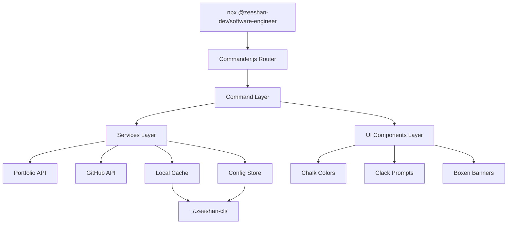

# Architecture

## High-Level Architecture

The `@zeeshan-dev/software-engineer` package is built using Node.js and TypeScript, designed with a modular, layered architecture.

## Directory Structure

- **`src/index.ts`**: The main entry point. Sets up `Commander.js` for argument parsing and handles the main interactive loop.
- **`src/commands/`**: Contains individual command handlers (e.g., `about.ts`, `projects.ts`). Each command focuses solely on orchestration.
- **`src/services/`**: Business logic and data fetching.
  - `portfolio.service.ts`: Fetches data from the Vercel API and manages fallbacks.
  - `github.service.ts`: Fetches and aggregates GitHub stats.
  - `cache.service.ts`: Manages the local JSON cache at `~/.zeeshan-cli/`.
  - `config.service.ts`: Manages user settings (theme) using the `conf` package.
- **`src/ui/`**: Pure presentation logic.
  - `colors.ts`: Theme definitions and `chalk` wrappers.
  - `banner.ts`: Startup banners and MOTD.
  - `menu.ts`: Interactive prompts using `@clack/prompts`.
  - `spinner.ts`: Loading indicators using `ora`.
  - `animations.ts`: Terminal animations (e.g., typewriter effect).
- **`src/types/`**: TypeScript interfaces shared across the application.
- **`src/data/`**: Hardcoded fallback data used when network requests fail and cache is empty.

## Data Flow (Fetch Strategy)
1. **Cache Check**: Is the data cached and fresh (< 24h)? If yes, return cache.
2. **Network Request**: Attempt to fetch from the live API. If successful, update cache and return.
3. **Stale Cache**: If network fails, return stale cache if available.
4. **Fallback Data**: If network fails and no cache exists, return hardcoded fallback JSON.
